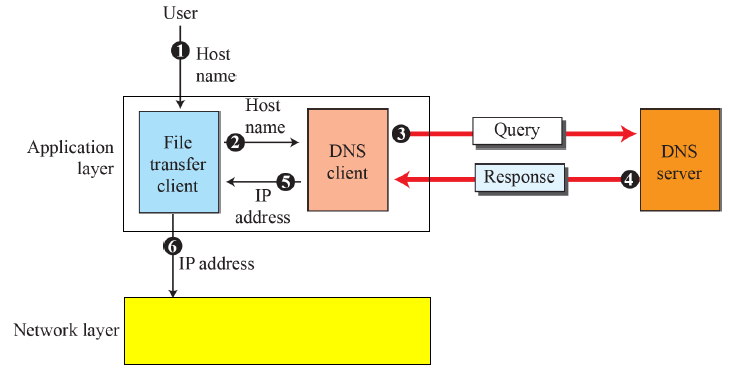

## DOMAIN NAME SYSTEM (DNS)
- in TCP/IP, IP address is used to *identify a host* on the Internet
- Internet: needs to have a directory system that can map a name to an address
- Central directory system cannot hold all the mapping
- Solution: *distribute* the information among many computers by DNS<br /><br />


## STEPS OF DNS

- User passes the host name to the file transfer client
- File transfer client passes the host name to the DNS client
- DNS client sends a message to a DNS server with a query that gives the file transfer server name
- DNS server address is known after being booted
- DNS server responds with the IP address
- DNS client passes the IP address
- File transfer client now uses the received IP address<br /><br /><br /><br />


## HOW TO COMPILE & RUN
1. Write down the address to find in the 'client/address.txt' file.
2. Write down the address and corresponding IP number stored in local server in the 'local-server/local_dns.txt' file.
3. Write down the address ends with '.com' and corresponding IP number stored in global server in the 'global-server/global_com_dns.txt' file.
4. Write down the address ends with '.edu' and corresponding IP number stored in global server in the 'global-server/global_edu_dns.txt' file.
5. Create three terminals for client, local server, and global server.
6. For the first terminal, go into the 'global-server' directory.
    ```
    cd global-server/
    ```
7. For the second terminal, go into the 'local-server' directory.
    ```
    cd local-server/
    ```
8. For the last terminal, go into the 'client' directory.
    ```
    cd client/
    ```
9. Compile 'globalServer.c', 'localServer.c', and 'client.c' at corresponding directory.
    ```c
    // for Window
    gcc globalServer.c -o globalServer -lws2_32 -Wall
    gcc localServer.c -o localServer -lws2_32 -Wall
    gcc client.c -o client -lws2_32 -Wall
    // for Linux
    gcc globalServer.c -o globalServer
    gcc localServer.c -o localServer
    gcc client.c -o client
    ```
10. Run globalServer first, then localServer, then client.
    ```c
    // for Window
    globalServer
    localServer
    client
    // for Linux
    ./globalServer
    ./localServer
    ./client
    ```
11. See the results.<br /><br />


## CODE EXPLANATION
The client will read the file 'address.txt' to know which domain's IP address it needs to receive and send the domain to the local server. Then, local server will look for its list to see if there is the information and sends IP address back to the client if it can find the right information. However, when local server cannot find the information, it will request to global server with the received domain. Then, the global server will look for its list of domains and sends back the corresponding information to the local server, which will then send the received information to the client.