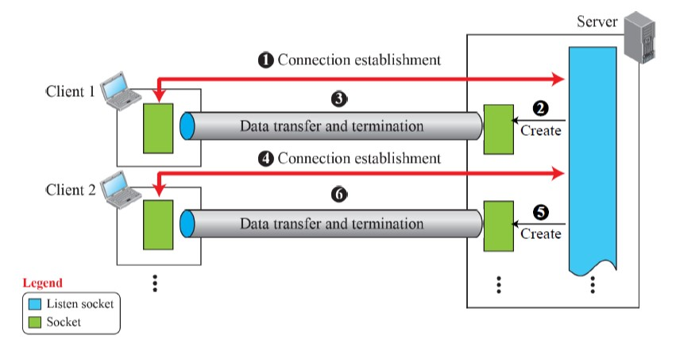

## TCP PROTOCOL
- provides ```html <span style="color:red">connection-oriented</span> ```, ```html <span style="color:red">reliable</span> ```, ```html <span style="color:red">byte-stream</span> ``` service
- **Handshaking process**: first create a ```html <span style="color:red">logical connection</span> ``` by exchanging connection-establishment packets
    - establishes parameters between two ends
    - size of the data packets
    - size of buffers to be used for holding the chunks of data
- continuity of the bytes can be checked
    - numbering the bytes exchanged
    - receiver can request to resend the losing bytes
- can provide flow control & congestion control
- disadvantage: not message-oriented
- useful to send ```html <span style="color:red">long message</span> ```
- when ```html <span style="color:red">reliability</span> ``` may benefit
- e.g. file transfer applications<br /><br />


## COMMUNICATION USING TCP

- **Listen socket**: for listening and establishing connection from client
- **Socket**: for exchanging data with the client
- to seperate connection phase from the data exchange phase
- may use buffer with pointer to make sure the whole message is sent<br /><br /><br /><br />


## HOW TO COMPILE & RUN
1. Put the file to transfer into directory 'sdir'.
2. Create two terminal, each for server and client.
3. For the first terminal, go into the 'sdir' directory.
    ```
    cd sdir/
    ```
4. For the second terminal, go into the 'cdir' directory.
    ```
    cd cdir/
    ```
5. Compile both 'TCP_server.c' and 'TCP_client.c' at corresponding directory.
    ```c
    // for Window
    gcc TCP_server.c -o server -lws2_32 -Wall
    gcc TCP_client.c -o client -lws2_32 -Wall
    // for Linux
    gcc TCP_server.c -o server
    gcc TCP_client.c -o client
    ```
6. Run server first with two arguments, port number and file name.
    ```c
    // for Window
    server 9999 sample.txt
    // for Linux
    ./server 9999 sample.txt
    ```
7. Run client at second terminal with two arguments, host IP and port number.
    ```c
    // for Window
    client 127.0.0.1 9999
    // for Linux
    ./client 127.0.0.1 9999
    ```
8. See the results.<br /><br />


## CODE EXPLANATION
When client and server are connected to each other, server will send the name of the file (set by arguments) and the file itself to client.
