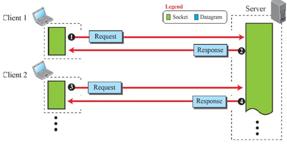

## UDP PROTOCOL
- provides *connectionless*, *unreliable*, *datagram* service
- no logical connection between the two ends exchanging messages
    - message: *independent entity* encapsulated in a packet called datagram
- does not see any relation (connection) between consequent datagrams of same source & destination
- not a reliable protocol
    - may check the data is not corrupted during the transmission
    - does not ask sender to resent the corrupted/lost datagram
- advantage: message-oriented
    - gives boundaries to the messages exchanged
- useful to send small messages
- when simplicity and speed is more important than the reliability
- e.g. (post office), management and multimedia applications<br /><br />


## COMMUNICATION USING UDP

- **only one socket** for each client and server
- server makes a *passive* open waiting for a client making a connection
- client makes an *active* open starting a connection<br /><br /><br /><br />


## HOW TO COMPILE & RUN
1. Put the file to transfer into directory 'sdir/sendingFile'.
2. Create two terminal, each for server and client.
3. For the first terminal, go into the 'sdir' directory.
    ```
    cd sdir/
    ```
4. For the second terminal, go into the 'cdir' directory.
    ```
    cd cdir/
    ```
5. Compile both 'UDP_server.c' and 'UDP_client.c' at corresponding directory.
    ```c
    // for Window
    gcc UDP_server.c -o server -lws2_32 -Wall
    gcc UDP_client.c -o client -lws2_32 -Wall
    // for Linux
    gcc UDP_server.c -o server
    gcc UDP_client.c -o client
    ```
6. Run server first with two arguments, port number and file name.
    ```c
    // for Window
    server
    // for Linux
    ./server
    ```
7. Run client at second terminal with two arguments, host IP and port number.
    ```c
    // for Window
    client 127.0.0.1 9999
    // for Linux
    ./client 127.0.0.1 9999
    ```
8. See the results.<br /><br />


## CODE EXPLANATION
When client and server are connected to each other, client will first request the FLIST (file lists) that server has. Within the file list, client will request with either number of name of the file so that the server can send the corresponding file to client.